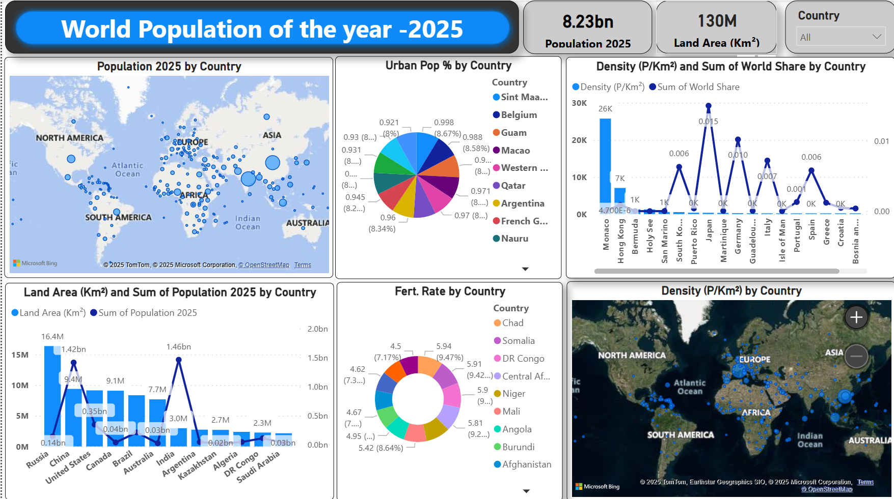

# 🌍 World Population Analysis – 2025
### Global Demographics Dashboard | Data Analytics & Visualization

---

## 📌 Project Overview
This project presents a **comprehensive analysis of global population trends for the year 2025** using an interactive data dashboard.  
It integrates **population size, land area, population density, urbanization levels, fertility rates, and global population share** to provide a complete demographic perspective across countries and regions.

The dashboard is designed to support **data-driven insights, comparative analysis, and strategic decision-making** for analysts, researchers, policymakers, and business leaders.

---

## 🌐 Key Global Indicators (2025)

| Indicator | Value |
|---------|-------|
| 🌍 World Population | **8.23 Billion** |
| 🗺️ Total Land Area | **130 Million Km²** |
| 🏙️ Urbanization Metric | Urban Population % by Country |
| 👶 Growth Indicator | Fertility Rate by Country |

---

## 📊 Dashboard Components & Insights

### 1️⃣ Population 2025 by Country (World Map)
**Description**
- Country-wise population distribution using bubble mapping
- Bubble size represents population magnitude

**Insights**
- Asia holds the largest share of the world population
- India and China remain dominant contributors
- Africa shows widespread population growth potential
- Europe and Oceania have comparatively smaller population clusters

📌 *Population distribution is highly uneven, concentrated mainly in Asia.*

---

### 2️⃣ Urban Population % by Country
**Description**
- Percentage of population living in urban areas
- Focus on highly urbanized countries and regions

**Insights**
- Countries like **Belgium, Qatar, Macao, Guam, and San Marino** show urbanization levels above **90%**
- High urbanization reflects advanced infrastructure and limited rural land

📌 *Urban growth potential is higher in developing regions than in developed economies.*

---

### 3️⃣ Population Density & World Share by Country
**Description**
- Population density (People per Km²)
- Country-wise share of global population

**Insights**
- **Monaco, Hong Kong, Macao, and Singapore** have extremely high population density
- Large population does not always mean high density
- A small number of countries contribute a major share of global population

📌 *Geographical constraints play a major role in population density.*

---

### 4️⃣ Land Area vs Population Comparison
**Description**
- Dual-axis comparison of land area and population

**Insights**
- **Russia** has the largest land area but relatively lower population
- **India** has a massive population with moderate land area
- **Australia and Canada** show low population density despite large land mass

📌 *Land availability does not directly correlate with population size.*

---

### 5️⃣ Fertility Rate by Country
**Description**
- Average number of children per woman
- Highlights future population growth regions

**Insights**
- High fertility rates observed in **Chad, Somalia, DR Congo, Niger, Mali, and Afghanistan**
- Strong correlation with lower urbanization and developing economies

📌 *Future global population growth will be driven mainly by Africa and parts of Asia.*

---

### 6️⃣ Population Density – Geographic View
**Description**
- Geographic visualization of population density

**Insights**
- Europe shows clustered medium-to-high density
- Asia contains both extremely dense and sparse regions
- Africa shows uneven but rapidly increasing density

📌 *Population pressure is increasing in urban and developing regions.*

---

## 🔍 Executive-Level Insights
- Global population has reached **8.23 billion**, increasing pressure on infrastructure and resources  
- Urbanization is near saturation in developed nations  
- Africa and South Asia will dominate future population growth  
- High land area does not guarantee high population or economic output  
- Fertility trends indicate long-term demographic and labor market shifts  

---

## 🛠️ Tools & Technologies
- **Power BI** – Data modeling and visualization  
- **Microsoft Bing Maps** – Geospatial mapping  
- **OpenStreetMap / TomTom** – Location intelligence  
- **DAX & Data Modeling** – KPI calculations  

---

## 📂 Repository Structure
